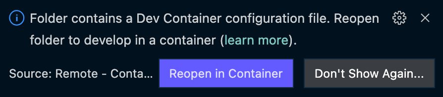
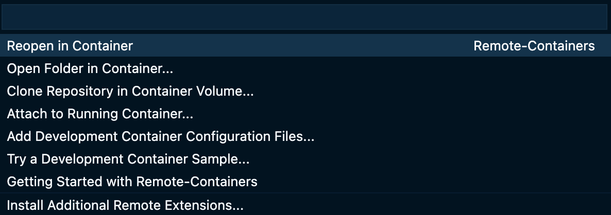

# Klarna Demo Using Stripe Sources

This demo is designed to run using [VS Code Dev Containers](https://code.visualstudio.com/docs/remote/containers), which relies on Docker. Most steps will be documented in this context.

## Getting Started

When opening the Project Directory in VS Code, you'll be prompted to reopen the project in a Dev Container. This will build the Docker image and attach your VS Code instance to the running Docker container.



You can also click the Remote Containers icon  in the very bottom left of VS-Code and select "Reopen in Container"



## Authentication

[Stripe API Key Documentation](https://stripe.com/docs/keys)

For authenticating the server, copy [`.env.example`](.env.example) as `.env`, then add your *Stripe Secret Key* as the `STRIPE_API_KEY`.

For authenticating Stripe.js, you'll need to add your *Stripe publishable key* at the top of [`public/main.js`](public/main.js).

## Starting the development server

From VS Code's Run and Debug menu, run "Debug server".

Alternatively, from a terminal, run

```shell
$ foreman start
```

## Listening for webhooks

The Docker image comes preinstalled with the Stripe CLI for forwarding webhooks for development. Start it by running the VS Code task "start Stripe Webhook forwarding", or by running in a terminal:

```shell
$ stripe listen --forward-to localhost:4567/webhook
```

Note, running this the first time will prompt you to authenticate with Stripe by following a link in your browser.